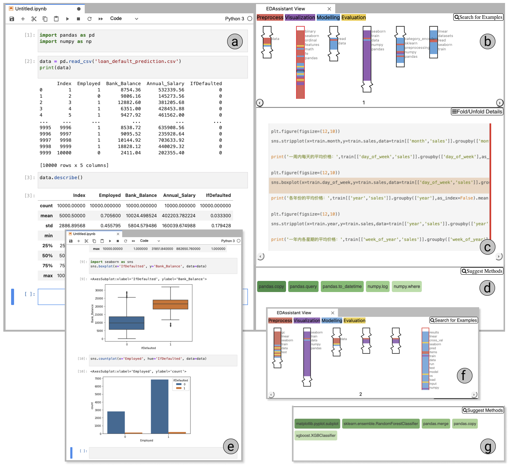

# EDAssitant

EDAssistant is an interactive and visual tool that facilitates exploratory data analysis (EDA) with in-situ code search, exploration, and recommendation based on existing notebook repositories, embedded within the JupyterLab environment for a seamless user experience. 

Based on a large Jupter Notebook corpus collected on Kaggle, EDAssistant employs advanced deep learning models, specially
GraphCodeBERT, to learn a latent representation (i.e., embeddings) of all the EDA sequences.
The backend of EDAssistant contains a search engine for retrieving relevant EDA sequences based on a data scientist’s current code and a recommender for potential APIs to use next, which facilitates their EDA with useful examples and suggestions. 
The frontend of EDAssitant is a visual interface, as a JupyterLab extension, that allows users to conduct EDA while accessing EDAssistant smoothly.
The user interface also features a novel visualization that provides an informative overview of the search results and the coding patterns in EDA notebooks.

Figure Description: A data scientist is conducting EDA on a bank loan default dataset with EDAssistant, which is a JupyterLab extension to offer situated EDA support with three interactively coordinated views for Search Results (b), Notebook Detail (c), and API Suggestion (d).

## JupyterLab Extension 
Follow the instructions in the README.md under the `extension` folder. 

## Backend
Follow the instructions in the README.md under the `backend` folder. 
